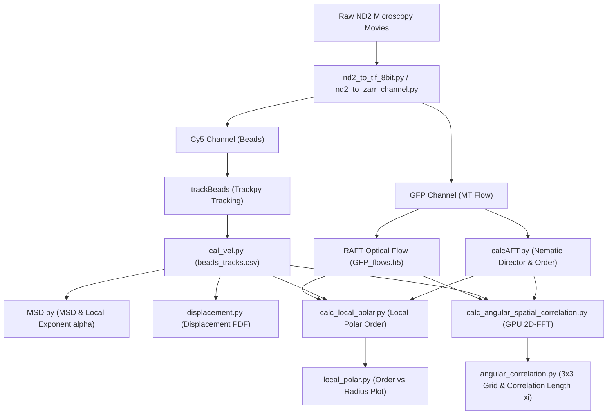

# MTCargo_analysis

微小管（Microtubule, MT）およびモータータンパク質（キネシン等）によって駆動されるアクティブマター流動場と、そこに包埋されたカーゴ微粒子（蛍光ビーズ）の相互作用・輸送ダイナミクスを定量解析するための統合 Python ツールキットです。

---

## 📑 目次
1. [全体解析パイプラインの概要](#-全体解析パイプラインの概要)
2. [Pixi タスク一覧 (ワンライナー実行)](#-pixi-タスク一覧-ワンライナー実行)
3. [前処理 & 画像フォーマット変換](#-1-前処理--画像フォーマット変換)
4. [粒子トラッキング & 速度解析](#-2-粒子トラッキング--速度解析)
5. [微小管ネマチック配向 & 光学的流速場解析](#-3-微小管ネマチック配向--光学的流速場解析)
6. [平均二乗変位 (MSD) & 異常拡散解析](#-4-平均二乗変位-msd--異常拡散解析)
7. [局所ポーラーオーダー解析](#-5-局所ポーラーオーダー解析)
8. [角度空間相関 & 主成分分解解析 (GPU 高速化)](#-6-角度空間相関--主成分分解解析-gpu-高速化)
9. [その他の解析モジュール (VACF, RDF, 動画生成)](#-7-その他の解析モジュール)
10. [環境構築 & NAS 同期](#-環境構築--nas-同期)

---

## 🔄 全体解析パイプラインの概要



---

## ⚡ Pixi タスク一覧 (ワンライナー実行)

`pixi.toml` に定義されたショートカットタスクにより、一括バッチ計算やプロット生成を簡単に実行できます。  
※ 末尾に `--root_dir /path/to/data` などの引数を追加して渡すことが可能です。

### 1. 角度空間相関タスク（全体・第1主成分・第2主成分を GPU で自動計算）
| タスク名 | コマンド例 | 対象 |
| :--- | :--- | :--- |
| `corr_all` | `pixi run corr_all --root_dir /mnt/NAS-Ebanaru/Sasaki/MTsingleBeads` | **全ビーズ条件** (`beads06um` 〜 `beads20um`) |
| `corr_06um` | `pixi run corr_06um --root_dir /mnt/NAS-Ebanaru/Sasaki/MTsingleBeads` | $0.63\ \mu\text{m}$ ビーズ |
| `corr_1um` | `pixi run corr_1um --root_dir /mnt/NAS-Ebanaru/Sasaki/MTsingleBeads` | $1.0\ \mu\text{m}$ ビーズ |
| `corr_3um` | `pixi run corr_3um --root_dir /mnt/NAS-Ebanaru/Sasaki/MTsingleBeads` | $3.0\ \mu\text{m}$ ビーズ |
| `corr_5um` | `pixi run corr_5um --root_dir /mnt/NAS-Ebanaru/Sasaki/MTsingleBeads` | $5.0\ \mu\text{m}$ ビーズ |
| `corr_7um` | `pixi run corr_7um --root_dir /mnt/NAS-Ebanaru/Sasaki/MTsingleBeads` | $7.0\ \mu\text{m}$ ビーズ |
| `corr_20um` | `pixi run corr_20um --root_dir /mnt/NAS-Ebanaru/Sasaki/MTsingleBeads` | $20.0\ \mu\text{m}$ ビーズ |

### 2. 局所ポーラーオーダータスク
| タスク名 | コマンド例 | 対象 |
| :--- | :--- | :--- |
| `polar_all` | `pixi run polar_all --root_dir /mnt/NAS-Ebanaru/Sasaki/MTsingleBeads` | **全ビーズ条件** (`beads06um` 〜 `beads20um`) |
| `polar_1um` | `pixi run polar_1um --root_dir /mnt/NAS-Ebanaru/Sasaki/MTsingleBeads` | $1.0\ \mu\text{m}$ ビーズ (各サイズ別 `polar_XXum` あり) |

### 3. 一括全解析タスク (ポーラーオーダー & 角度空間相関)
```bash
pixi run analyze_all --root_dir /mnt/NAS-Ebanaru/Sasaki/MTsingleBeads
```

### 4. プロット & サマリー生成タスク
| タスク名 | コマンド例 | 説明 |
| :--- | :--- | :--- |
| `plot_corr` | `pixi run plot_corr --root_dir /mnt/NAS-Ebanaru/Sasaki/MTsingleBeads --save_fig angular_correlation_summary.svg` | 3成分 $\times$ 3対象の $3 \times 3$ 角度相関プロット & 相関長フィッティング |
| `plot_polar` | `pixi run plot_polar` | 局所ポーラーオーダーの全ビーズ比較プロット |
| `msd` | `pixi run msd` | MSD / 無次元化 MSD / 局所異常拡散指数 $\alpha(t)$ のプロット |

---

## 📷 1. 前処理 & 画像フォーマット変換

顕微鏡（Nikon ND2 形式）から取得したマルチチャンネル時系列画像を、後続の解析に適した形式（TIFF 連番 / Zarr）に変換します。

### ND2 $\to$ 8-bit TIFF 連番変換 (`libs/nd2_to_tif_8bit.py`)
光学的流速推定（RAFT）の入力用として、各チャンネル（例: GFP）を 8-bit TIFF 画像群に出力します。
```bash
pixi run python libs/nd2_to_tif_8bit.py \
    /path/to/movie.nd2 \
    /path/to/output_dir/GFP \
    --channel GFP
```

### ND2 $\to$ Zarr 変換 (`libs/nd2_to_zarr_channel.py`)
時系列画像スタックを高効率・省メモリにアクセス可能な Zarr 形式に変換します。ガウシアンフィルタによるノイズ低減 (`--sigma`) も指定可能です。
```bash
# 微小管 (GFP) チャンネル
pixi run python libs/nd2_to_zarr_channel.py \
    --file_path /path/to/movie.nd2 \
    --out_dir /path/to/output_dir \
    --channel GFP \
    --out_name "GFP.zarr"

# ビーズ (Cy5) チャンネル (平滑化あり)
pixi run python libs/nd2_to_zarr_channel.py \
    --file_path /path/to/movie.nd2 \
    --out_dir /path/to/output_dir \
    --channel Cy5 \
    --sigma '(0,2,2)' \
    --out_name "beads.zarr"
```

---

## 🎯 2. 粒子トラッキング & 速度解析

### ビーズ粒子の検出とトラッキング (`notebooks/trackBeads.ipynb`)
`trackpy` を使用して蛍光ビーズの重心位置 $(x, y)$ をサブピクセル精度で検出し、フレーム間をリンキングして軌跡を追跡します。
- 出力: `beads_tracks.csv`（列: `['frame', 'particle', 'x', 'y', 'mass', 'size', 'ecc', 'signal', 'raw_mass', 'ep']`）

### 粒子速度ベクトルの算出 (`libs/cal_vel.py`)
粒子軌跡データからフレーム間変位 $(dx, dy)$、規格化速度ベクトル $(\hat{u}_x, \hat{u}_y)$、および平均流速を計算して CSV に付与します。
```bash
# beads_tracks.csv に変位・速度ベクトル列を追加し、平均速度 velocities_mean.csv を出力
pixi run python libs/cal_vel.py /path/to/experiment_dir
```

---

## 🌊 3. 微小管ネマチック配向 & 光学的流速場解析

### 2D-FFT 配向解析 (AFT: Automated Fiber Tracking) (`libs/calcAFT.py`)
微小管蛍光画像 (`GFP.zarr`) の局所領域に 2D-FFT を適用し、各ピクセルにおける局所ネマチック配向角 $\theta \in [-\pi/2, \pi/2]$ および配向秩序度 $S \in [0, 1]$ を算出します。
```bash
pixi run python libs/calcAFT.py \
    /path/to/experiment_dir \
    --zarr_path "GFP.zarr" \
    --neighborhood_radius 5
```
- 出力: `MTs_im_theta.zarr`（局所配向角）、`MTs_order_parameter.zarr`（配向秩序度）

### 光学的流速場推定 (Optical Flow)
RAFT モデル等を用いて微小管の連続フレーム間の変位流速場 $\mathbf{u}(x, y, t) = (u_x, u_y)$ をピクセル単位で高密度推定します。
- 出力: `GFP_flows.h5`（shape: `(frames, 2, height, width)`）

---

## 📈 4. 平均二乗変位 (MSD) & 異常拡散解析

粒子軌跡からアクティブ輸送の拡散特性や異常拡散指数を網羅的に解析します。

### MSD 集計 & 無次元化解析 (`MSD.py`)
```bash
pixi run msd
# または
pixi run python MSD.py
```
- **個々の粒子 MSD (IMSD) & アンサンブル平均 MSD (EMSD)**: $\langle \Delta r^2(\Delta t) \rangle$
- **無次元化 MSD**: 微小管外径 $d_{\text{MT}}$ およびアクティブ流速 $v_0$ から特性時間 $\tau_c = d_{\text{MT}} / v_0$ を定義し、無次元 lag time $\Delta\tilde{t} = \Delta t / \tau_c$ でスケーリング。
- **局所異常拡散指数 $\alpha(t)$ の算出**:
  $$
  \alpha(t) = \frac{d \log \langle \Delta r^2 \rangle}{d \log \Delta t}
  $$
- **出力図**: `dimensionless_MSD.png`, `local_alpha.png`, `dimensionless_local_alpha.png` 等

### 主軸射影変位の確率密度関数 (`libs/displacement.py`)
大域ネマチック主軸に平行な方向 ($\Delta r_\parallel$) および直交する方向 ($\Delta r_\perp$) への変位分布 (Van Hove correlation function) を算出します。
```python
from libs import displacement as dpm

# 平行成分・直角成分の変位 PDF を算出
pdf_par = dpm.PDF_theta(df_tracks, tau=10, theta_array=thetas, component='parallel')
pdf_perp = dpm.PDF_theta(df_tracks, tau=10, theta_array=thetas, component='perpendicular')
```

---

## 🧭 5. 局所ポーラーオーダー解析

ビーズの周囲あるいは背景領域において、微小管の流速ベクトルがどれほど揃って一方向に流れているか（ポーラー秩序度）をスケール依存で評価します。

### 局所ポーラーオーダーの計算 (`libs/calc_local_polar.py` / `libs/calc_bg_polar.py`)
```bash
# ビーズ周囲の局所ポーラーオーダー（粒子半径内を除外して計算）
pixi run python libs/calc_local_polar.py /path/to/experiment_dir --particle_radius 6

# 安全な背景領域 (ROI) における局所ポーラーオーダー
pixi run python libs/calc_bg_polar.py /path/to/experiment_dir
```
- 出力: `local_polar_order_w.zarr`, `local_polar_order_bg.zarr`

### 全条件の比較プロット (`local_polar.py`)
```bash
pixi run plot_polar
# または
pixi run python local_polar.py
```
- ウィンドウサイズ $r$ に対するポーラーオーダーの減衰曲線をビーズ径別に比較プロットします。

---

## ⚡ 6. 角度空間相関 & 主成分分解解析 (GPU 高速化)

微小管流速の空間相関、ビーズ運動と周囲流速の相互相関、および大域ネマチック主軸への分解相関を **2D Real-FFT (周波数ドメイン畳み込み)** により超高速に算出します。

### 高速化エンジン (`libs/fft_convolution.py`)
- **445倍の高速化**: 1フレームあたり 33.1s $\to$ **0.074s**（GPU/CUDA 利用時）。
- **省メモリ GPU ストリーミング**: カーネルスペクトルを CPU に保持し逐次転送（VRAM 使用量 **< 50MB**）。
- **直交分解の性質**: 単位流速ベクトル $\hat{\mathbf{u}}$ を大域ネマチック角 $\theta(t)$ の主軸（第1主成分: Parallel）および直交方向（第2主成分: Perpendicular）へ射影：
  $$
  u_\parallel = \hat{u}_x \cos\theta + \hat{u}_y \sin\theta, \quad u_\perp = -\hat{u}_x \sin\theta + \hat{u}_y \cos\theta
  $$
  $$
  C_{\text{total}}(r) = C_\parallel(r) + C_\perp(r) \quad \text{（厳密に成立）}
  $$

### 単一実験ディレクトリの計算 (`libs/calc_angular_spatial_correlation.py`, `libs/calc_bg_angular_correlation.py`)
```bash
# 粒子周囲の角度相関（Total, Parallel, Perpendicular）
pixi run python libs/calc_angular_spatial_correlation.py /path/to/experiment_dir --particle_radius 6

# 背景領域の角度相関（Total, Parallel, Perpendicular）
pixi run python libs/calc_bg_angular_correlation.py /path/to/experiment_dir
```
- 出力: `angular_correlation_w.zarr`, `angular_correlation_bg.zarr`

### 全条件の集計プロット & 相関長フィッティング (`angular_correlation.py`)
```bash
pixi run plot_corr \
    --root_dir /mnt/NAS-Ebanaru/Sasaki/MTsingleBeads \
    --conditions beads06um beads1um beads3um beads5um beads7um beads20um \
    --save_fig angular_correlation_summary.svg
```
- $3 \times 3$ グリッド（行: 全体 / 第1主成分 / 第2主成分、列: 粒子周囲流速 / ビーズ速度 vs 流速 / 背景流速）で自動プロット。
- 指数減衰モデル $C(r) = a \exp(-r/\xi) + c$ による各相関長 $\xi, \xi_\parallel, \xi_\perp$ を自動算出してサマリー表を出力。

---

## 🔬 7. その他の解析モジュール

| モジュール | スクリプト / ノートブック | 機能説明 |
| :--- | :--- | :--- |
| **速度自己相関** | [`libs/vacf.py`](libs/vacf.py), [`libs/vacf_analysis.py`](libs/vacf_analysis.py) | ビーズ速度の自己相関関数 (VACF: Velocity Auto-Correlation Function) $\langle \mathbf{v}(0) \cdot \mathbf{v}(t) \rangle$ の計算 |
| **動径分布関数** | [`libs/RDF.py`](libs/RDF.py), [`libs/RDF_analysis.py`](libs/RDF_analysis.py) | ビーズ粒子間の空間配置秩序 (RDF: Radial Distribution Function) $g(r)$ の計算 |
| **ひずみ速度** | [`libs/calc_strain_rate.py`](libs/calc_strain_rate.py) | 流速場テンソルの空間微分によるせん断・膨張ひずみ速度場の算出 |
| **可視化動画** | [`libs/visualize_flow_video.py`](libs/visualize_flow_video.py), [`libs/movie.py`](libs/movie.py) | 流速ベクトル場とビーズトラッキング軌跡をオーバーレイした MP4 動画の生成 |

---

## 🔧 環境構築 & NAS 同期

### 環境構築 (Pixi)
本プロジェクトは [Pixi](https://pixi.sh/) によって依存関係および GPU/CPU 環境が管理されています。

```bash
# 依存関係のインストール
pixi install

# 任意のスクリプトの実行
pixi run python <script_name>.py
```

### Makefile による NAS 同期 (`rsync`)
ローカル環境と解析用 NAS サーバーの間でデータ・コードを同期できます。

- **差分確認 (dry-run)**:
  ```bash
  make dry-run NAS_USER=sasaki NAS_HOST=nas.local NAS_DIR=/mnt/nas/MTCargo_analysis
  ```
- **ローカル $\to$ NAS 送信 (push)**:
  ```bash
  make push NAS_USER=sasaki NAS_HOST=nas.local NAS_DIR=/mnt/nas/MTCargo_analysis SSH_KEY=~/.ssh/id_rsa
  ```
- **NAS $\to$ ローカル 受信 (pull)**:
  ```bash
  make pull NAS_USER=sasaki NAS_HOST=nas.local NAS_DIR=/mnt/nas/MTCargo_analysis
  ```