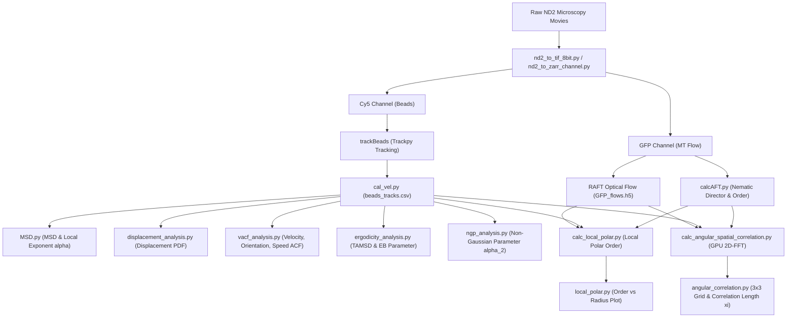

# MTCargo_analysis

微小管（Microtubule, MT）およびモータータンパク質（キネシン等）によって駆動されるアクティブマター流動場と、そこに包埋されたカーゴ微粒子（蛍光ビーズ）の相互作用・輸送ダイナミクスを定量解析するための統合 Python ツールキットです。

---

## 📑 目次
1. [全体解析パイプラインの概要](#-全体解析パイプラインの概要)
2. [Pixi タスク一覧 (ワンライナー実行)](#-pixi-タスク一覧-ワンライナー実行)
3. [前処理 & 画像フォーマット変換](#-1-前処理--画像フォーマット変換)
4. [粒子トラッキング & 速度解析](#-2-粒子トラッキング--速度解析)
5. [微小管ネマチック配向 & 光学的流速場解析](#-3-微小管ネマチック配向--光学的流速場解析)
6. [平均二乗変位 (MSD) & 異常拡散解析](#-4-平均二乗変位-msd--異常拡散解析)
7. [変位絶対値 & 確率密度関数 (PDF) 解析](#-5-変位絶対値--確率密度関数-pdf-解析)
8. [自己相関関数 (VACF / OACF / SACF) 一括解析](#-6-自己相関関数-vacf--oacf--sacf-一括解析)
9. [エルゴード性破壊パラメータ (EB) & TAMSD 解析](#-7-エルゴード性破壊パラメータ-eb--tamsd-解析)
10. [ノンガウシアンパラメータ (NGP / $\alpha_2$) 解析](#-8-ノンガウシアンパラメータ-ngp--alpha_2-解析)
11. [局所ポーラーオーダー解析](#-9-局所ポーラーオーダー解析)
12. [角度空間相関 & 主成分分解解析 (GPU 高速化)](#-10-角度空間相関--主成分分解解析-gpu-高速化)
13. [その他の解析モジュール (RDF, 動画生成等)](#-11-その他の解析モジュール)
14. [環境構築 & NAS 同期](#-環境構築--nas-同期)

---

## 🔄 全体解析パイプラインの概要



---

## ⚡ Pixi タスク一覧 (ワンライナー実行)

`pixi.toml` に定義されたショートカットタスクにより、一括バッチ計算やプロット生成を簡単に実行できます。  
※ 末尾に `--root_dir /path/to/data` などの引数を追加して渡すことが可能です。

### 1. プロット & サマリー生成タスク
| タスク名 | コマンド例 | 説明 |
| :--- | :--- | :--- |
| `ngp` | `pixi run ngp` | ノンガウシアンパラメータ $\alpha_2(\Delta t)$ の全ビーズ一括解析 |
| `ergodicity` | `pixi run ergodicity` | エルゴード性破壊パラメータ $EB(\Delta t)$ & 時間平均二乗変位 (TAMSD) の全ビーズ一括解析 |
| `displacement` | `pixi run displacement` | 2次元変位ノルム $|\Delta\mathbf{r}|$ の確率密度関数 (PDF) 解析 & フィッティング |
| `displacement_all` | `pixi run displacement_all` | 全コンポーネント（ノルム・平行・直交成分）の一括 PDF 解析 |
| `angle_pdf` | `pixi run angle_pdf` | 進行方向角度変化 $\Delta\theta$ の確率密度関数 (PDF) & von Mises フィッティング |
| `angle_pdf_abs` | `pixi run angle_pdf_abs` | 絶対角度変化 $\|\Delta\theta\|$ の確率密度関数 (PDF) 解析 |
| `speed_vs_angle` | `pixi run speed_vs_angle` | 縦軸速さ $v$ / 規格化速さ $\langle v/\bar{v} \rangle$ vs 横軸方向転換角 $\|\Delta\theta\|$ の相関解析 |
| `vacf` | `pixi run vacf` | 速度・配向・速さの自己相関関数 (VACF, OACF, SACF) の全ビーズ一括解析 |
| `msd` | `pixi run msd` | MSD / 無次元化 MSD / 局所異常拡散指数 $\alpha(t)$ のプロット |
| `plot_corr` | `pixi run plot_corr` | 3成分 $\times$ 3対象の $3 \times 3$ 角度相関プロット & 相関長フィッティング |
| `plot_polar` | `pixi run plot_polar` | 局所ポーラーオーダーの全ビーズ比較プロット |

### 2. 角度空間相関タスク（全体・第1主成分・第2主成分を GPU で自動計算）
| タスク名 | コマンド例 | 対象 |
| :--- | :--- | :--- |
| `corr_all` | `pixi run corr_all --root_dir /Volumes/data/Sasaki/MTsingleBeads` | **全ビーズ条件** (`beads06um` 〜 `beads20um`) |
| `corr_06um` | `pixi run corr_06um` | $0.63\ \mu\text{m}$ ビーズ (各サイズ別 `corr_XXum` あり) |

### 3. 局所ポーラーオーダータスク
| タスク名 | コマンド例 | 対象 |
| :--- | :--- | :--- |
| `polar_all` | `pixi run polar_all --root_dir /Volumes/data/Sasaki/MTsingleBeads` | **全ビーズ条件** (`beads06um` 〜 `beads20um`) |

---

## 📷 1. 前処理 & 画像フォーマット変換

顕微鏡（Nikon ND2 形式）から取得したマルチチャンネル時系列画像を、後続の解析に適した形式（TIFF 連番 / Zarr）に変換します。

### ND2 $\to$ 8-bit TIFF 連番変換 (`libs/nd2_to_tif_8bit.py`)
光学的流速推定（RAFT）の入力用として、各チャンネル（例: GFP）を 8-bit TIFF 画像群に出力します。
```bash
pixi run python libs/nd2_to_tif_8bit.py \
    /path/to/movie.nd2 \
    /path/to/output_dir/GFP \
    --channel GFP
```

### ND2 $\to$ Zarr 変換 (`libs/nd2_to_zarr_channel.py`)
時系列画像スタックを高効率・省メモリにアクセス可能な Zarr 形式に変換します。ガウシアンフィルタによるノイズ低減 (`--sigma`) も指定可能です。
```bash
# 微小管 (GFP) チャンネル
pixi run python libs/nd2_to_zarr_channel.py \
    --file_path /path/to/movie.nd2 \
    --out_dir /path/to/output_dir \
    --channel GFP \
    --out_name "GFP.zarr"

# ビーズ (Cy5) チャンネル (平滑化あり)
pixi run python libs/nd2_to_zarr_channel.py \
    --file_path /path/to/movie.nd2 \
    --out_dir /path/to/output_dir \
    --channel Cy5 \
    --sigma '(0,2,2)' \
    --out_name "beads.zarr"
```

---

## 🎯 2. 粒子トラッキング & 速度解析

### ビーズ粒子の検出とトラッキング (`notebooks/trackBeads.ipynb`)
`trackpy` を使用して蛍光ビーズの重心位置 $(x, y)$ をサブピクセル精度で検出し、フレーム間をリンキングして軌跡を追跡します。
- 出力: `beads_tracks.csv`（列: `['frame', 'particle', 'x', 'y', 'mass', 'size', 'ecc', 'signal', 'raw_mass', 'ep']`）

### 粒子速度ベクトルの算出 (`libs/cal_vel.py`)
粒子軌跡データからフレーム間変位 $(dx, dy)$、規格化速度ベクトル $(\hat{u}_x, \hat{u}_y)$、および平均流速を計算して CSV に付与します。
```bash
# beads_tracks.csv に変位・速度ベクトル列を追加し、平均速度 velocities_mean.csv を出力
pixi run python libs/cal_vel.py /path/to/experiment_dir
```

---

## 🌊 3. 微小管ネマチック配向 & 光学的流速場解析

### 2D-FFT 配向解析 (AFT: Automated Fiber Tracking) (`libs/calcAFT.py`)
微小管蛍光画像 (`GFP.zarr`) の局所領域に 2D-FFT を適用し、各ピクセルにおける局所ネマチック配向角 $\theta \in [-\pi/2, \pi/2]$ および配向秩序度 $S \in [0, 1]$ を算出します。
```bash
pixi run python libs/calcAFT.py \
    /path/to/experiment_dir \
    --zarr_path "GFP.zarr" \
    --neighborhood_radius 5
```
- 出力: `MTs_im_theta.zarr`（局所配向角）、`MTs_order_parameter.zarr`（配向秩序度）

### 光学的流速場推定 (Optical Flow)
RAFT モデル等を用いて微小管の連続フレーム間の変位流速場 $\mathbf{u}(x, y, t) = (u_x, u_y)$ をピクセル単位で高密度推定します。
- 出力: `GFP_flows.h5`（shape: `(frames, 2, height, width)`）

---

## 📈 4. 平均二乗変位 (MSD) & 異常拡散解析

粒子軌跡からアクティブ輸送の拡散特性や異常拡散指数を網羅的に解析します。

### MSD 集計 & 無次元化解析 (`MSD.py`)
```bash
pixi run msd
```
- **個々の粒子 MSD (IMSD) & アンサンブル平均 MSD (EMSD)**: $\langle \Delta r^2(\Delta t) \rangle$
- **無次元化 MSD**: 微小管外径 $d_{\text{MT}}$ およびアクティブ流速 $v_0$ から特性時間 $\tau_c = d_{\text{MT}} / v_0$ を定義し、無次元 lag time $\Delta\tilde{t} = \Delta t / \tau_c$ でスケーリング。
- **局所異常拡散指数 $\alpha(t)$ の算出**:
  $$
  \alpha(t) = \frac{d \log \langle \Delta r^2 \rangle}{d \log \Delta t}
  $$
- **出力図**: `dimensionless_MSD.png`, `local_alpha.png`, `dimensionless_local_alpha.png` 等

---

## 📊 5. 変位絶対値 & 確率密度関数 (PDF) 解析

ビーズ粒子の変位絶対値（2次元ノルム $|\Delta\mathbf{r}|$、1次元 $|\Delta x|, |\Delta y|$、大域ネマチック主軸射影 $|\Delta r_\parallel|, |\Delta r_\perp|$）および変位確率密度関数 (PDF) を全ビーズ条件（$0.63\ \mu\text{m} \sim 20\ \mu\text{m}$）で一括算出・プロット・フィッティングします。

```bash
# デフォルト実行: 2次元変位ノルム |Δr| の PDF 解析 & 指数・べき乗フィッティング & スケーリングプロット
pixi run displacement

# 全成分（2次元ノルム・主軸平行成分・直交成分）を一括計算
pixi run displacement_all
```

#### 📐 解析機能とフィッティングモデル
1. **変位 PDF の指数分布フィッティング (対数空間)**:
   $$
   P(\Delta r) = A \exp\left( - \frac{\Delta r}{\lambda} \right) \quad \Longleftrightarrow \quad \ln P(\Delta r) = \ln A - \frac{\Delta r}{\lambda}
   $$
2. **特性減衰長の時間発展 $\lambda(\Delta t)$ & べき乗則フィッティング**:
   $$
   \lambda(\Delta t) = C \, (\Delta t)^\alpha \quad \Longleftrightarrow \quad \ln \lambda(\Delta t) = \ln C + \alpha \ln \Delta t
   $$
3. **データコラップス（スケーリング関数 & マスター曲線）**:
   $$
   \xi = \frac{\Delta r}{\lambda(\Delta t)}, \quad \tilde{P}(\xi) = \lambda(\Delta t) P(\Delta r) \quad \longrightarrow \quad f(\xi) = e^{-\xi}
   $$

### 🔄 進行方向角度変化 (Turning Angle) & 確率密度関数 (PDF) 解析 (`angle_change_analysis.py`, [`libs/angular_distribution.py`](libs/angular_distribution.py))

粒子軌跡の進行方向角 $\theta(t) = \operatorname{atan2}(v_y(t), v_x(t))$ から、ラグタイム $\Delta t$ における方向転換角（Turning Angle / 角度変化） $\Delta\theta(t) = \operatorname{wrap}(\theta(t+\Delta t) - \theta(t))$ の確率密度関数 (PDF) および円統計（Circular Statistics）を一括解析・可視化します。

```bash
# デフォルト実行: 符号付き角度変化 Δθ ∈ [-180°, 180°] の PDF 解析 & von Mises フィッティング
pixi run angle_pdf

# 絶対角度変化 |Δθ| ∈ [0°, 180°] の PDF 解析
pixi run angle_pdf_abs

# カスタム引数指定例 (ラジアン単位、ガウス分布フィッティング、ラグタイム指定)
pixi run python angle_change_analysis.py \
    --root_dir /Volumes/data/Sasaki/MTsingleBeads \
    --unit rad \
    --fit_model von_mises \
    --tau_seconds 4 8 20 40 100 \
    --beads beads06um beads1um beads3um beads5um beads7um beads20um
```

#### 📐 確率分布モデル & 円統計指標
1. **von Mises 分布（円正規分布）フィッティング**:
   $$
   P(\Delta\theta) = \frac{\exp\left( \kappa \cos(\Delta\theta - \mu) \right)}{2\pi I_0(\kappa)}
   $$
   - $\kappa$（集中度パラメータ / Concentration parameter）: 粒子の直進性・方向持続性の強さを定量化（$\kappa \to 0$ で完全等方ランダムウォーク、$\kappa \gg 1$ で直進運動）。
   - $I_0(\kappa)$ は第1種0次変形ベッセル関数。

2. **等方的一様分布の基準線（Isotropic Uniform Random Walk）**:
   $$
   P_{\text{uniform}}(\Delta\theta) = \frac{1}{360^\circ} \approx 0.00278\ [^\circ{}^{-1}] \quad \left( = \frac{1}{2\pi} \approx 0.159\ [\text{rad}^{-1}] \right)
   $$

3. **方向持続性パラメータの時間発展 $\langle \cos\Delta\theta \rangle(\Delta t)$**:
   - 平均コサイン $\langle \cos\Delta\theta(\Delta t) \rangle$ は配向自己相関関数 (OACF) と直結し、長ラグタイムで 0（方向の完全ランダム化）へと減衰。

#### 📂 主な出力ファイル (`figure/angle_change/`)
- `angle_change_PDF_tau<sec>s.svg/.png`: 各ラグタイムにおける全ビーズ比較 PDF プロット（von Mises フィット曲線 & 実験間エラーバンド入り）
- `angle_change_PDF_grid.svg/.png`: 代表ラグタイム（4s, 8s, 20s, 40s, 100s）の一覧グリッドプロット
- `angle_change_persistence_evolution.svg/.png`: 持続性パラメータ $\langle \cos\Delta\theta \rangle(\Delta t)$ の時間発展プロット
- `angle_change_statistics_summary.csv`: 円平均、円分散 $V = 1 - R$、円標準偏差 $\sigma_{\text{circ}} = \sqrt{-2\ln R}$、$\langle \cos\Delta\theta \rangle$ 等のサマリー
- `angle_change_fitting_summary.csv`: 各条件での von Mises 集中度 $\kappa$, $\mu$, 決定係数 $R^2$ の一覧

### 🏃 速さ $v$ vs 方向転換角 $\Delta\theta$ 相関解析 & 速さコントラスト $\Delta v$ (`speed_vs_angle_analysis.py`, [`libs/speed_vs_angle.py`](libs/speed_vs_angle.py))

粒子が直進しているときと急激に方向転換しているときで移動速さ $v$ がどのように変化するか（直進時の加速や反転・旋回時の減速、Run-and-Tumble 的挙動）を定量化するため、縦軸に速さ比 $R(\Delta\theta) = \frac{\langle v \rangle(\Delta\theta)}{\langle v \rangle}$（または速さ $v$）、横軸に符号付き方向転換角 $\Delta\theta \in [-180^\circ, 180^\circ]$（または絶対値 $|\Delta\theta| \in [0^\circ, 180^\circ]$）をプロットし、速さコントラスト $\Delta v$ を算出します。

```bash
# 全ビーズサイズ・全ラグタイムにおける 速さ比 R(Δθ)・速さコントラスト Δv の一括解析 & プロット
pixi run speed_vs_angle

# カスタム引数指定例 (ラジアン単位、ビーズ指定、ラグタイム指定)
pixi run python speed_vs_angle_analysis.py \
    --root_dir /Volumes/data/Sasaki/MTsingleBeads \
    --unit deg \
    --bins 24 \
    --tau_seconds 4 8 20 40 100 \
    --beads beads06um beads1um beads3um beads5um beads7um beads20um
```

#### 📐 解析手法と出力指標
1. **符号付き速さ比プロファイル $R(\Delta\theta) = \frac{\langle v \rangle(\Delta\theta)}{\langle v \rangle}$ vs $\Delta\theta \in [-180^\circ, 180^\circ]$**:
   - 左右旋回の対称性を確認。直進時（$\Delta\theta = 0^\circ$）で $R(0^\circ) \approx 1.3 \sim 1.6$ のピーク（直進加速）、反転・急旋回時（$\Delta\theta \to \pm 180^\circ$）で $R(\pm 180^\circ) \approx 0.65 \sim 0.75$ への減速を確認。
2. **規格化速さコントラスト $\Delta v$ (Speed Contrast)**:
   $$
   \Delta v = \frac{\langle v \rangle(0^\circ) - \langle v \rangle(180^\circ)}{\langle v \rangle} = R(0^\circ) - R(180^\circ)
   $$
   - 直進時速さと反転時速さの比率コントラストを実験間アンサンブル平均・標準誤差で定量化。
   - ラグタイム依存性 $\Delta v(\Delta t)$ および 粒子径依存性 $\Delta v(d)$ を可視化。
3. **速さ・角度相関係数 $r(v, |\Delta\theta|)$ & $r(v, \cos\Delta\theta)$ の算出**:
   - 各ラグタイムにおける Pearson 相関係数 $r$（および $p$ 値）、Spearman 順位相関係数 $\rho$、配向コサイン相関 $r(v, \cos\Delta\theta)$ を自動計算。
4. **2D結合確率密度 $P(\Delta\theta, v)$ の 6-Panel ヒートマップ**:
   - ビーズサイズごとに $(\Delta\theta, v)$ の2次元結合分布および平均プロファイル曲線を可視化。

#### 📂 主な出力ファイル (`figure/speed_vs_angle/`)
- `speed_ratio_R_signed_tau<sec>s.svg/.png`: 符号付き速さ比 $R(\Delta\theta)$ vs $\Delta\theta$ プロット（凡例に相関係数 $r$ を表示）
- `speed_ratio_R_signed_grid.svg/.png`: 代表ラグタイムの一覧グリッドプロット
- `speed_ratio_R_abs_tau<sec>s.svg/.png`: 絶対値速さ比 $R(|\Delta\theta|)$ vs $|\Delta\theta|$ プロット
- `speed_ratio_R_abs_grid.svg/.png`: 絶対値速さ比の一覧グリッドプロット
- `speed_vs_angle_tau<sec>s.svg/.png`: 速さ $v$ [$\mu\text{m/s}$] vs $\Delta\theta$ プロット
- `speed_vs_angle_grid.svg/.png`: 速さ $v$ の一覧グリッドプロット
- `speed_contrast_delta_v_evolution.svg/.png`: 規格化速さコントラスト $\Delta v = R(0^\circ) - R(180^\circ)$ のラグタイム時間発展プロット
- `speed_contrast_delta_v_vs_diameter.svg/.png`: 粒子径 $d$ に対する速さコントラスト $\Delta v$ プロット
- `speed_angle_joint_2d_tau<sec>s.svg/.png`: 2D結合確率密度ヒートマップ (6-Panel)
- `speed_angle_correlation_evolution.svg/.png`: 相関係数 $r(v, |\Delta\theta|)$ のラグタイム時間発展プロット
- `speed_contrast_delta_v_summary.csv`: 規格化速さコントラスト $\Delta v$、絶対差 $\Delta v_{\text{abs}}$、$\langle v \rangle(0^\circ)$, $\langle v \rangle(180^\circ)$, $\langle v \rangle$, $R(0^\circ)$, $R(180^\circ)$ サマリー CSV
- `speed_ratio_R_signed_summary.csv`: 符号付き角度ビン中心、平均速さ、速さ比 $R(\Delta\theta)$、標準偏差、サンプル数 CSV
- `speed_ratio_R_abs_summary.csv`: 絶対値角度ビン中心、平均速さ、速さ比 $R(|\Delta\theta|)$、標準偏差、サンプル数 CSV
- `speed_angle_correlation_summary.csv`: 各条件における相関係数一覧サマリー CSV

---

## 🔄 6. 自己相関関数 (VACF / OACF / SACF / 速度ゆらぎ / 角度変化) 一括解析

ビーズの運動の自己相関関数を、**速度ベクトル (VACF)**、**配向単位ベクトル (OACF)**、**速さスカラー (SACF)**、**速度ゆらぎ**、および **角度変化 (進行方向の回転角 $\Delta\theta$)** のモードで全ビーズサイズ（$0.63\ \mu\text{m} \sim 20.0\ \mu\text{m}$）に対して一括計算・プロットします。

```bash
# 全ビーズサイズ・主要3モード (VACF, OACF, SACF) を一括計算
pixi run vacf

# 角度変化 (Δθ) の自己相関関数を一括計算 & 指数減衰フィッティング
pixi run python vacf_analysis.py --mode angle_change angle_change_fluctuation --fit

# 速度ゆらぎ・速さゆらぎの自己相関関数を一括計算
pixi run python vacf_analysis.py --mode velocity_fluctuation speed_fluctuation --fit

# 全7モード（ゆらぎ・角度変化含む）を一括計算
pixi run python vacf_analysis.py --mode all_with_fluc --fit
```

#### 📐 自己相関関数の定義 & フィッティングモデル
| モード | 名称 | 数式 | 特徴 |
| :--- | :--- | :--- | :--- |
| `velocity` | **速度ベクトル自己相関 (VACF)** | $\frac{\langle \vec{v}(t) \cdot \vec{v}(t+\Delta t) \rangle}{\langle |\vec{v}|^2 \rangle}$ | 速度ベクトルの向きと大きさの持続性を評価 |
| `orientation` | **配向方向自己相関 (OACF)** | $\langle \hat{v}(t) \cdot \hat{v}(t+\Delta t) \rangle = \langle \cos\Delta\theta \rangle$ | 運動方向の持続性・回転拡散を評価 ($\tau=0$ で 1.0) |
| `speed` | **速さスカラー自己相関 (SACF)** | $\frac{\langle v(t) v(t+\Delta t) \rangle}{\langle v^2 \rangle}$ | 粒子の速さの大きさ（スカラー）の相関時間を評価 |
| `velocity_fluctuation` | **速度ベクトルゆらぎ自己相関** | $\frac{\langle \delta\vec{v}(t) \cdot \delta\vec{v}(t+\Delta t) \rangle}{\langle |\delta\vec{v}|^2 \rangle}$ | 時間平均速度を差し引いた純粋な速度ゆらぎ $\delta\vec{v}(t) = \vec{v}(t) - \bar{\vec{v}}$ の相関 |
| `speed_fluctuation` | **速さゆらぎ自己相関** | $\frac{\langle \delta v(t) \delta v(t+\Delta t) \rangle}{\langle (\delta v)^2 \rangle}$ | 平均速さを差し引いた速さゆらぎ $\delta v(t) = v(t) - \bar{v}$ の相関（自己共分散） |
| `angle_change` | **角度変化自己相関** | $\frac{\langle \Delta\theta(t) \Delta\theta(t+\Delta t) \rangle}{\langle (\Delta\theta)^2 \rangle}$ | 進行方向の方向転換角（角速度） $\Delta\theta(t) = \operatorname{wrap}(\theta(t+1)-\theta(t))$ の自己相関 |
| `angle_change_fluctuation` | **角度変化ゆらぎ自己相関** | $\frac{\langle \delta\Delta\theta(t) \delta\Delta\theta(t+\Delta t) \rangle}{\langle (\delta\Delta\theta)^2 \rangle}$ | 平均回転角を差し引いた角度変化ゆらぎの自己相関 |

- **指数減衰フィッティングモデル (`--fit`)**:
  $$
  f(\Delta t) = (1 - A) \exp\left( - \frac{\Delta t}{\xi} \right) + A
  $$
  - $\xi$: 特性減衰時間・相関時間 (Decay correlation time [s])
  - $A$: 長時間漸近オフセット (Asymptotic offset)
  - $\Delta t = 0$ で $f(0) = 1$ を満たす物理的モデル

#### 📂 主な出力ファイル (`figure/autocorrelation/`)
- `VELOCITY_ACF.svg/.png`, `ORIENTATION_ACF.svg/.png`, `SPEED_ACF.svg/.png` (各モードの全ビーズ比較図、フィット曲線入り)
- `all_ACF_comparison.svg/.png` (3モード横並び総合比較プロット)
- `ACF_fits_summary.csv` (全ビーズ・各モードの相関時間 $\xi$, オフセット $A$, 決定係数 $R^2$)
- `VELOCITY_summary.csv`, `ORIENTATION_summary.csv`, `SPEED_summary.csv` (各 lag time の平均値・標準偏差・実験数)

---

## 🧬 7. エルゴード性破壊パラメータ (EB) & TAMSD 解析

アクティブ輸送における非エルゴード性や粒子の個性（ヘテロジェニティ）を定量化するため、**時間平均二乗変位 (TAMSD)** および **エルゴード性破壊パラメータ (EB: Ergodicity Breaking Parameter)** を全ビーズ条件で一括算出します。

```bash
# 全ビーズサイズの EB & TAMSD を一括解析
pixi run ergodicity

# 成分指定（2d, x, y, parallel, perpendicular）
pixi run python ergodicity_analysis.py --component parallel
```

#### 📐 エルゴード性破壊パラメータの理論定義
1. **各粒子 $i$ の時間平均二乗変位 (TAMSD $\overline{\delta_i^2(\Delta t)}$)**:
   $$
   \overline{\delta_i^2(\Delta t)} = \frac{1}{T - \Delta t} \int_0^{T - \Delta t} |\mathbf{r}_i(t + \Delta t) - \mathbf{r}_i(t)|^2 dt
   $$
2. **エルゴード性破壊パラメータ $EB(\Delta t)$**:
   $$
   EB(\Delta t) = \frac{\langle (\overline{\delta^2(\Delta t)})^2 \rangle - \langle \overline{\delta^2(\Delta t)} \rangle^2}{\langle \overline{\delta^2(\Delta t)} \rangle^2} = \frac{\mathrm{Var}(\overline{\delta^2(\Delta t)})}{\langle \overline{\delta^2(\Delta t)} \rangle^2}
   $$
   - **エルゴード的系（標準ブラウン運動等）**: 軌道長 $T \to \infty$ で $EB(\Delta t) \to 0$ （$\sim \Delta t / T$）
   - **非エルゴード的系（CTRW、トラッピング、ガラス転移等）**: 長時間極限でも $EB(\Delta t) > 0$ （有限値にとどまる）

#### 📂 主な出力ファイル (`figure/ergodicity/`)
- `EB_loglog_<comp>.svg/.png` (全ビーズの $EB(\Delta t)$ vs $\Delta t$ 両対数比較プロット)
- `EB_linear_<comp>.svg/.png` (全ビーズの $EB(\Delta t)$ vs $\Delta t$ 線形比較プロット)
- `TAMSD_all_beads_<comp>.svg/.png` (全ビーズのアンサンブル平均 TAMSD $\langle \overline{\delta^2} \rangle$ 比較図)
- `TAMSD_individual_grids_<comp>.svg/.png` (ビーズごとの個別粒子 TAMSD 曲線群 6パネルグリッド)
- `EB_summary_<comp>.csv` (全ビーズ・各 lag time の統計サマリー)

---

## 📈 8. ノンガウシアンパラメータ (NGP / $\alpha_2$) 解析

変位確率分布が標準ブラウン運動（ガウス分布）からどれほど乖離しているか（裾野の重さや不均一輸送の度合い）を定量化するため、**ノンガウシアンパラメータ (Non-Gaussian Parameter: $\alpha_2(\Delta t)$)** を全ビーズ条件（$0.63\ \mu\text{m} \sim 20.0\ \mu\text{m}$）で一括算出します。

```bash
# 全ビーズサイズの NGP (α_2) を一括解析
pixi run ngp

# 成分指定（2d, x, y, parallel, perpendicular）
pixi run python ngp_analysis.py --component parallel
```

#### 📐 ノンガウシアンパラメータの理論定義 (Rahman, 1964)
- **2次元変位ノルム ($d = 2$)**:
  $$
  \alpha_2(\Delta t) = \frac{1}{2} \frac{\langle |\Delta\mathbf{r}(\Delta t)|^4 \rangle}{\langle |\Delta\mathbf{r}(\Delta t)|^2 \rangle^2} - 1
  $$
- **1次元変位 ($d = 1$, $x, y, \Delta r_\parallel, \Delta r_\perp$)**:
  $$
  \alpha_2(\Delta t) = \frac{1}{3} \frac{\langle \Delta x(\Delta t)^4 \rangle}{\langle \Delta x(\Delta t)^2 \rangle^2} - 1
  $$
- **物理的解釈**:
  - $\alpha_2 = 0$: 完全なガウス分布（均一な熱的ブラウン運動）
  - $\alpha_2 > 0$: 非ガウス性（指数テール、レヴィ的跳躍、動的ヘテロジェニティ、微小管流動による間欠的駆動）
  - $\alpha_2 < 0$: 空間的束縛・ケージング運動

#### 📂 主な出力ファイル (`figure/ngp/`)
- `NGP_linear_<comp>.svg/.png` (全ビーズの $\alpha_2(\Delta t)$ vs $\Delta t$ 線形プロット、ガウス基準線 $\alpha_2=0$ 入り)
- `NGP_loglog_<comp>.svg/.png` (全ビーズの $\alpha_2(\Delta t)$ vs $\Delta t$ 両対数プロット)
- `NGP_summary_<comp>.csv` (全ビーズ・各 lag time の $\alpha_2$ 平均値、標準偏差、標準誤差、MSD $\langle r^2 \rangle$、4次モーメント $\langle r^4 \rangle$、サンプル数、実験数)

---

## 🧭 9. 局所ポーラーオーダー解析

ビーズの周囲あるいは背景領域において、微小管の流速ベクトルがどれほど揃って一方向に流れているか（ポーラー秩序度）をスケール依存で評価します。

### 局所ポーラーオーダーの計算 (`libs/calc_local_polar.py` / `libs/calc_bg_polar.py`)
```bash
# ビーズ周囲の局所ポーラーオーダー（粒子半径内を除外して計算）
pixi run python libs/calc_local_polar.py /path/to/experiment_dir --particle_radius 6

# 安全な背景領域 (ROI) における局所ポーラーオーダー
pixi run python libs/calc_bg_polar.py /path/to/experiment_dir
```
- 出力: `local_polar_order_w.zarr`, `local_polar_order_bg.zarr`

### 全条件の比較プロット (`local_polar.py`)
```bash
pixi run plot_polar
```

---

## ⚡ 10. 角度空間相関 & 主成分分解解析 (GPU 高速化)

微小管流速の空間相関、ビーズ運動と周囲流速の相互相関、および大域ネマチック主軸への分解相関を **2D Real-FFT (周波数ドメイン畳み込み)** により超高速に算出します。

### 全条件の集計プロット & 相関長フィッティング (`angular_correlation.py`)
```bash
pixi run plot_corr \
    --root_dir /Volumes/data/Sasaki/MTsingleBeads \
    --conditions beads06um beads1um beads3um beads5um beads7um beads20um \
    --save_fig angular_correlation_summary.svg
```
- $3 \times 3$ グリッド（行: 全体 / 第1主成分 / 第2主成分、列: 粒子周囲流速 / ビーズ速度 vs 流速 / 背景流速）で自動プロット。
- 指数減衰モデル $C(r) = a \exp(-r/\xi) + c$ による各相関長 $\xi, \xi_\parallel, \xi_\perp$ を自動算出。

---

## 🏃 11. 貨物粒子の Run / Tumble セグメンテーション & 時間分布解析

貨物微粒子（蛍光ビーズ）の移動速度に基づいて、能動輸送状態（**Run**）と停滞・方向転換状態（**Tumble**）をセグメンテーションし、それぞれの持続時間分布（PDF / CCDF）および平均寿命を定量評価します。

### Run / Tumble セグメンテーション解析の実行 (`run_tumble_analysis.py`)
```bash
# 全粒子径（0.63, 1.18, 3.37, 5.0, 7.24, 20.0 μm）の一括解析 & グラフ生成
pixi run python run_tumble_analysis.py \
    --output_dir figure/run_tumble \
    --threshold_mode bead_mean
```

- **セグメンテーション基準**: 各粒子径における平均速度 $\langle v \rangle$ を閾値 $v_{\mathrm{th}}$ とし、$v(t) \ge v_{\mathrm{th}}$ を **Run**, $v(t) < v_{\mathrm{th}}$ を **Tumble** と二値判定。
- **出力図表 (`figure/run_tumble/`)**:
  - `run_duration_distribution_pdf.png` / `.pdf`: 全粒子径の Run 時間確率密度関数 (PDF) 重ね合わせ
  - `tumble_duration_distribution_pdf.png` / `.pdf`: 全粒子径の Tumble 時間確率密度関数 (PDF) 重ね合わせ
  - `run_tumble_duration_ccdf.png` / `.pdf`: 相補累積分布関数 (CCDF) 比較プロット
  - `run_tumble_6panels.png` / `.pdf`: 各粒子径ごとの Run/Tumble 分布 6パネル詳細図（指数減衰フィッティング $P(\tau) \sim e^{-\tau/\tau_0}$ 付き）
  - `run_tumble_summary_vs_diameter.png` / `.pdf`: 粒子径 vs 平均持続時間・減衰時定数・Run時間比率（Duty cycle）のサマリー
  - `segmentation_sample_trajectories.png` / `.pdf`: 実際の軌跡上での Run / Tumble セグメンテーション時系列サンプル
  - `run_tumble_summary.csv` / `run_tumble_durations_all.csv`: 統計サマリーおよび全イベント持続時間データ

---

## 🤖 12. 隠れマルコフモデル (1D Gaussian HMM) による運動モード解析

貨物粒子の運動を、1次元の対数速力観測ベクトル
$$\mathbf{O}_t = \begin{pmatrix} \ln(v_t + \epsilon) \end{pmatrix}$$
を用いたガウス放出隠れマルコフモデル（Gaussian HMM）により、教師なし学習で自動同定・分類・定量化します。

### 理論的特徴
- **$\ln(v_t + \epsilon)$**: 速さの対数正規的な裾野の広がりを正規分布に適合させ、1次元ガウス放出モデルとの整合性を担保。
- **自動ラベリング (Label Sorting)**: 学習後に平均速度順に状態を整列（State 0: Tumble/Pause, State 1: Run）。
- **状態分離度 ($S_v$)**:
  $$S_v = \frac{|\mu_{\mathrm{fast}} - \mu_{\mathrm{slow}}|}{\sqrt{(\sigma_{\mathrm{fast}}^2 + \sigma_{\mathrm{slow}}^2)/2}}$$
  により、各粒子径での速度状態分離の明瞭度を定量化。
- **Viterbi復号 & 事後確率推定**: 最尤パスおよび各時刻の状態確率を算出。
- **状態別 MSD**: 各運動状態（Run / Tumble）が持続している連続セグメントから状態別 MSD および異常拡散指数 $\alpha$ を抽出。

### HMM 解析の実行 (`hmm_cargo_analysis.py`)
```bash
# --- 1次元速力 HMM 解析の実行 ---
pixi run hmm        # 全ビーズサイズの一括解析（図表・CSV生成）
pixi run hmm_bic    # モデル選択基準（ΔBIC_{2->1} vs 粒子径）を含めた完全実行
pixi run hmm_k3     # 3状態 (K=3) モデル解析
```

- **出力図表 (`figure/hmm_1d/`)**:
  - `hmm_emission_density_k2.svg` / `.png`: 観測空間 $\ln(v+\epsilon)$ における放出確率密度ヒストグラムと混合ガウスフィット（6パネル）
  - `hmm_trajectories_k2.svg`: 推定運動モード（Run: 緑, Tumble: 橙）で色分けされた代表粒子軌跡（6パネル）
  - `hmm_timeseries_sync_k2.svg`: 瞬時速度 $v(t)$、推定状態 $S_t$、事後確率 $P(S_t)$ の時系列同期プロット
  - `hmm_dwell_time_distributions_k2.svg`: 各状態の持続時間分布（PDF & CCDF）
  - `hmm_summary_vs_diameter_k2.svg`: 粒子径 vs 運動パラメータ（平均速度、速度幅、持続時間、状態占有率）
  - `hmm_transition_matrices_k2.svg`: 状態遷移確率行列 $A_{ij}$ のヒートマップ（6パネル）
  - `hmm_posterior_distributions_k2.svg`: 各状態の事後確率 $P(S_t = k \mid \mathbf{O})$ の確率密度分布（6パネル）
  - `hmm_confidence_vs_diameter_k2.svg`: 粒子径 vs 分類確信度（平均確信度、高確信度比率、エントロピー）
  - `hmm_state_msd_k2.svg`: 運動モード別（Run / Tumble / All）の平均二乗変位 MSD 曲線およびべき乗則フィッティング（6パネル）
  - `hmm_state_msd_params_vs_diameter_k2.png`: 粒子径 vs 状態別異常拡散指数 $\alpha_k$ および見かけの拡散係数 $D_k$
  - `hmm_separation_index_vs_diameter.svg` / `.png`: 粒子径 vs 状態分離度 $S_v$ プロット
  - `hmm_model_selection_bic.svg` / `.png`: 状態数 $K=1..4$ のモデル選択（BIC / AIC）
  - `hmm_delta_bic_2to1_vs_diameter.svg` / `.png`: 各粒子径ごとの $\Delta\mathrm{BIC}_{2\rightarrow 1}$ プロット
  - `hmm_separation_index_summary.csv` / `hmm_delta_bic_2to1_summary.csv` / 各種統計サマリー CSV

---

## 🔬 13. その他の解析モジュール

| モジュール | スクリプト / ノートブック | 機能説明 |
| :--- | :--- | :--- |
| **動径分布関数** | [`libs/RDF.py`](libs/RDF.py), [`libs/RDF_analysis.py`](libs/RDF_analysis.py) | ビーズ粒子間の空間配置秩序 (RDF: Radial Distribution Function) $g(r)$ の計算 |
| **ひずみ速度** | [`libs/calc_strain_rate.py`](libs/calc_strain_rate.py) | 流速場テンソルの空間微分によるせん断・膨張ひずみ速度場の算出 |
| **可視化動画** | [`libs/visualize_flow_video.py`](libs/visualize_flow_video.py), [`libs/movie.py`](libs/movie.py) | 流速ベクトル場とビーズトラッキング軌跡をオーバーレイした MP4 動画の生成 |

---

## 🔧 環境構築 & NAS 同期

### 環境構築 (Pixi)
本プロジェクトは [Pixi](https://pixi.sh/) によって依存関係および GPU/CPU 環境が管理されています。

```bash
# 依存関係のインストール
pixi install

# 任意のスクリプトの実行
pixi run python <script_name>.py
```

### Makefile による NAS 同期 (`rsync`)
ローカル環境と解析用 NAS サーバーの間でデータ・コードを同期できます。

- **差分確認 (dry-run)**:
  ```bash
  make dry-run NAS_USER=sasaki NAS_HOST=nas.local NAS_DIR=/mnt/nas/MTCargo_analysis
  ```
- **ローカル $\to$ NAS 送信 (push)**:
  ```bash
  make push NAS_USER=sasaki NAS_HOST=nas.local NAS_DIR=/mnt/nas/MTCargo_analysis SSH_KEY=~/.ssh/id_rsa
  ```
- **NAS $\to$ ローカル 受信 (pull)**:
  ```bash
  make pull NAS_USER=sasaki NAS_HOST=nas.local NAS_DIR=/mnt/nas/MTCargo_analysis
  ```